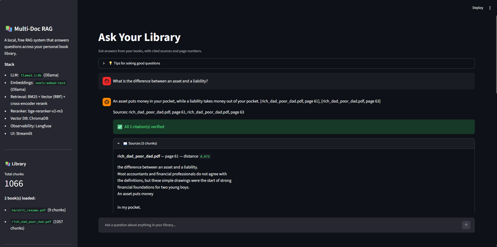
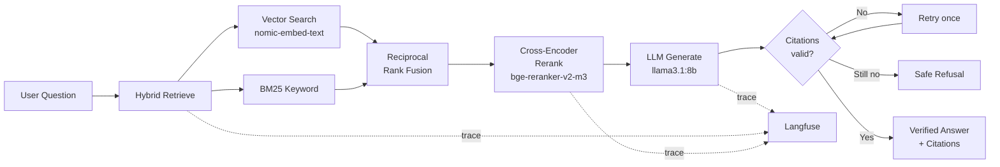
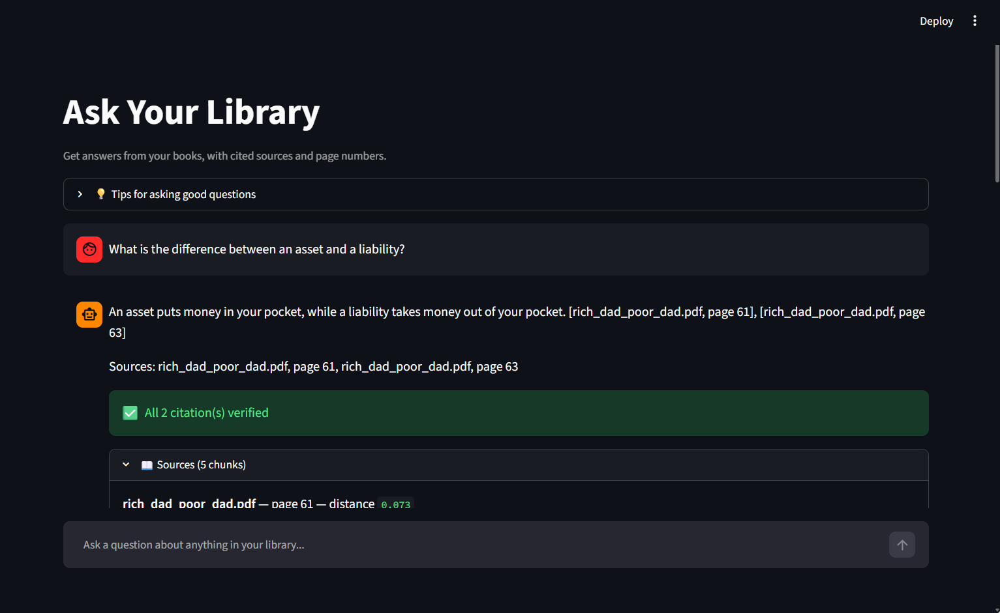
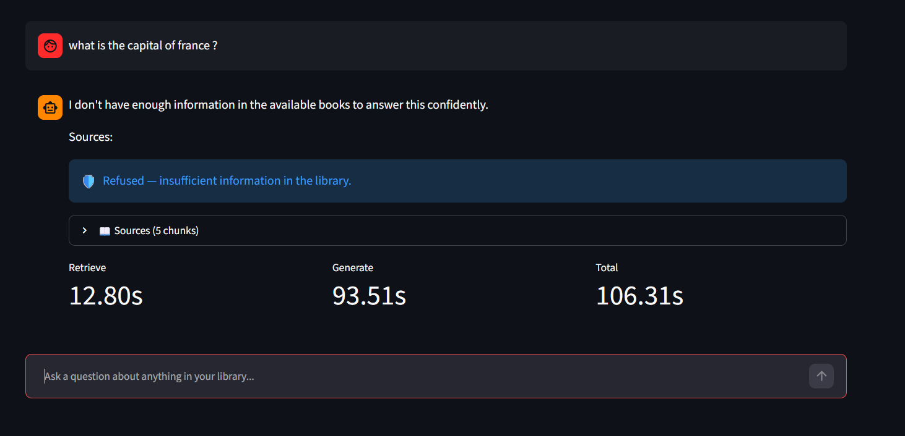
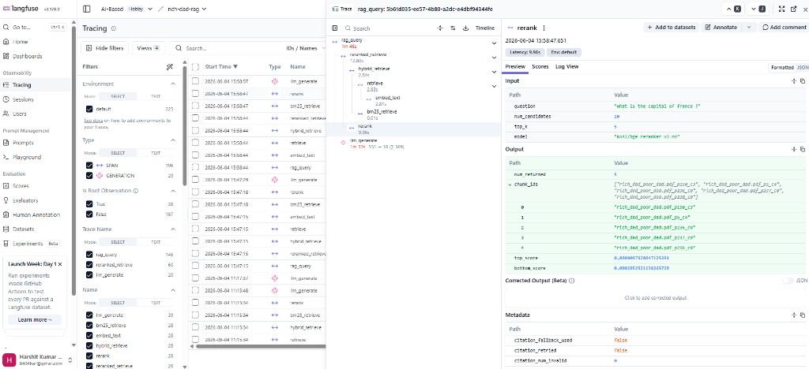
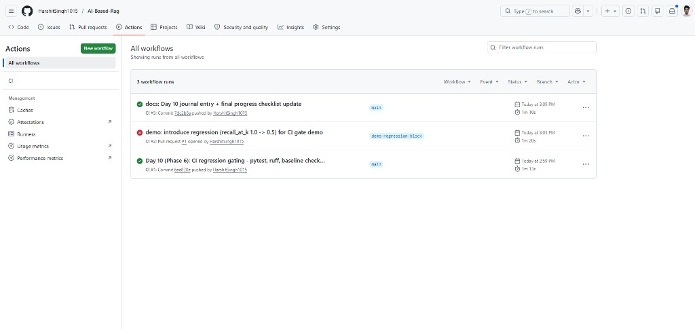
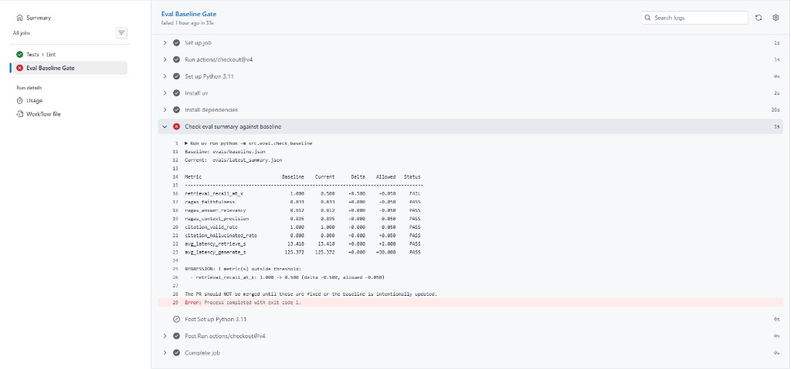

# Rich Dad RAG — Production-Grade Local RAG System

[](https://github.com/HarshitSingh1015/AI-Based-Rag/actions/workflows/ci.yml)


> Ask questions of your own documents. Every answer is grounded in a
> verified citation, or the system honestly refuses. Built from
> scratch over 11 days as a first AI engineering project.



**Demo video**: see [docs/demo_link.md](docs/demo_link.md) (90-second
walkthrough — coming with the Day 16 blog post).

---

## What it does

- **Hybrid retrieval**: BM25 keyword search + semantic vector search
  fused with Reciprocal Rank Fusion, then re-scored by a
  cross-encoder.
- **Citation enforcement**: every answer must cite a real
  `[filename.pdf, page N]` from the retrieved chunks — or the system
  refuses honestly. Hallucinated-citation rate on the golden set:
  **0.0%**.
- **Observability**: every query produces a Langfuse trace with
  latency, token usage, and full retrieval context.
- **CI-gated quality**: every pull request runs unit tests + a
  baseline regression check. PRs that drop recall, faithfulness, or
  any other metric past threshold are blocked from merging.

---

## Why this project exists

Most RAG demos are: load PDF → embed → query → trust the LLM.
That falls apart in production because:

1. Vector search alone misses exact-match keywords.
2. LLMs hallucinate sources confidently.
3. Nothing prevents quality regression as the codebase changes.

This project addresses all three with measurable, before/after
metrics — see the table below.

---

## Architecture



---

## Metrics — measured progression

All scores from the 10-question golden set in
`evals/golden_set.jsonl`. Numbers are real, not illustrative —
generated by `uv run python -m src.eval.run`.

| Phase | Day | Recall@5 | Faithfulness | Answer Rel. | Context Prec. | Hallucinated Cit. |
|-------|----:|---------:|-------------:|------------:|--------------:|------------------:|
| Baseline (vector only)     | 6 |  70.0%  | 0.719 | 0.649 | 0.580 | unmeasured |
| + Hybrid retrieval (RRF)   | 7 | **100.0%** | 0.850 | 0.820 | 0.719 | unmeasured |
| + Cross-encoder rerank     | 8 | 100.0% | 0.842 | 0.832 | **0.895** | unmeasured |
| + Citation enforcement     | 9 | 100.0% | 0.833 | 0.812 | 0.895 | **0.0%** |

**End-to-end gains (baseline → Day 9):** recall@5 **+30 pp**,
faithfulness **+0.115**, answer relevancy **+0.163**, context
precision **+0.315**, plus the new trust layer.

See [CHANGELOG.md](CHANGELOG.md) for the day-by-day story behind
each row.

---

## Quickstart (local)

```bash
git clone https://github.com/HarshitSingh1015/AI-Based-Rag.git
cd AI-Based-Rag

uv sync

ollama pull nomic-embed-text
ollama pull llama3.1:8b

cp .env.example .env
# fill in Langfuse keys (optional but recommended)

# Drop a PDF in data/raw/, then ingest:
uv run python ingest.py --all

uv run streamlit run app.py
```

Open <http://localhost:8501>.

---

## Demo questions

If you load *Rich Dad Poor Dad* into `data/raw/`, try:

| Question | Expected behavior |
|----------|-------------------|
| What is the difference between an asset and a liability? | Verified answer with `[rich_dad_poor_dad.pdf, page N]` citations |
| What does Robert Kiyosaki say about the rat race? | Verified answer |
| What is the capital of France? | Honest refusal (not in any loaded book) |
| Who wrote War and Peace? | Honest refusal |

The system is deliberately conservative: it would rather refuse than
guess.

---

## Tech stack

| Layer | Choice | Why |
|-------|--------|-----|
| LLM | Ollama + `llama3.1:8b` | Local, free, offline |
| Embeddings | Ollama + `nomic-embed-text` | Local, fast, free |
| Reranker | `BAAI/bge-reranker-v2-m3` | Best open cross-encoder |
| Vector DB | ChromaDB | Embedded, no infra |
| Keyword index | `rank-bm25` | In-memory, fast |
| UI | Streamlit | Minimal demo surface |
| Observability | Langfuse (cloud free tier) | Full traces, $0 |
| Evaluation | RAGAS + custom recall | LLM-as-judge + deterministic |
| CI | GitHub Actions | Free, integrated |

Everything in this stack is free for personal/portfolio use.

---

## Screenshots

### Verified answer with citations


### Honest refusal when context is missing


### Langfuse trace showing latency + token usage


### CI pipeline (green merges, red blocked regression)


### CI blocking a regression PR (`Eval Baseline Gate` job)


---

## Project structure

```
rich-dad-rag/
├── app.py                    # Streamlit UI
├── rag.py                    # End-to-end RAG entrypoint
├── chat.py                   # Interactive CLI
├── ingest.py                 # Document ingestion CLI
├── src/
│   ├── ingest/               # PDF loader, chunker, embedder, ChromaDB store
│   ├── retrieval/            # vector, BM25, hybrid (RRF), reranked
│   ├── rerank/               # cross-encoder wrapper
│   ├── generate/             # prompt builder, LLM wrapper, citation validator
│   ├── observability/        # Langfuse client setup
│   └── eval/                 # RAGAS runner + baseline check
├── tests/                    # pytest unit tests (citation, chunker, RRF)
├── evals/
│   ├── golden_set.jsonl      # 10 hand-curated Q&A pairs
│   ├── baseline.json         # frozen metrics (CI gate compares against this)
│   ├── latest_summary.json   # written by every eval run
│   └── results/              # full eval outputs (gitignored)
├── .github/workflows/ci.yml  # PRs run pytest + baseline gate
├── docs/screenshots/         # README assets
├── CHANGELOG.md              # day-by-day project journey
└── CONTRIBUTING.md           # two-tier CI workflow + how to update baseline
```

---

## Project journey

The full day-by-day breakdown — including every metric delta and
every design decision — lives in [CHANGELOG.md](CHANGELOG.md).

For contribution guidelines and the dev workflow, see
[CONTRIBUTING.md](CONTRIBUTING.md).

---

## License

MIT
