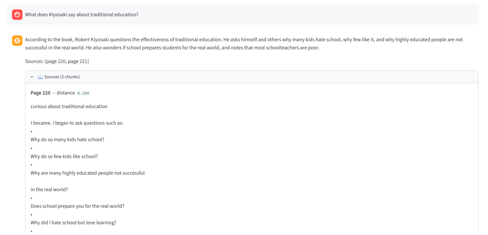

# Rich Dad Poor Dad RAG

A 100% local, free RAG (Retrieval-Augmented Generation) system that lets me ask
questions about *Rich Dad Poor Dad* by Robert Kiyosaki, with answers grounded
in the actual book text and proper source citations.

This is my first AI engineering project, built as a learning exercise and
portfolio piece demonstrating production-grade RAG patterns.

## Goals (v1)
- Hybrid retrieval (BM25 + vector search with RRF fusion)
- Cross-encoder reranking
- Citation enforcement (LLM must cite source chunks; answers without valid citations are rejected)
- Full observability via Langfuse (tracing, latency, simulated cost)
- CI-gated evaluation pipeline (regression-blocking on quality drops)

## Future versions (Plan A -> Plan C roadmap)
- v2: Add study notes (markdown/txt)
- v3: Add research papers (PDF) + company docs (DOCX)
- v4: Add codebase support (tree-sitter chunking)
- v5: Add legal contracts (clause-level chunking)

## Stack
- **LLM**: `llama3.1:8b` via Ollama (local)
- **Embeddings**: `nomic-embed-text` via Ollama (local)
- **Vector DB**: ChromaDB (file-based, local)
- **BM25**: `rank-bm25` (Python)
- **Reranker**: `bge-reranker-v2-m3` (via sentence-transformers, local)
- **Observability**: Langfuse Cloud (free tier)
- **Eval**: RAGAS (with local Ollama LLM-as-judge)
- **UI**: Streamlit
- **Package manager**: uv

## Example questions the v1 system should answer well
1. What's the difference between an asset and a liability according to Kiyosaki?
2. Who is the "rich dad" and who is the "poor dad"?
3. What does Kiyosaki mean by "the rat race"?
4. What's his view on traditional education vs. financial education?
5. What does he say about working for money vs. having money work for you?
6. What are the six main lessons in the book?
7. What does Kiyosaki say about fear and greed in financial decisions?

## Sample Q&A (Day 3 baseline)

### Q: What is the difference between an asset and a liability?
**A**: According to Robert Kiyosaki, the difference between an asset and a liability is that:

* An asset puts money in my pocket (Source 1 — page 61, Source 5 — page 63).
* A liability takes money out of my pocket (Source 1 — page 61, Source 5 — page 63).

Sources: [page 61, page 63]

_Latency: retrieve 60ms, generate 108.4s_

### Q: Who is the rich dad and who is the poor dad?
**A**: The rich dad is Robert Kiyosaki's best friend's father, a high school dropout who was wealthy. The poor dad is Robert Kiyosaki's own biological father, who was highly educated but struggled financially.

Sources: [page 229, page 20]

_Latency: retrieve 70ms, generate 82.7s_

> Note: This is the unoptimized baseline (vector-only retrieval, no reranking, no
> citation validation, llama3.1:8b on CPU). Hybrid retrieval, reranking, and
> citation enforcement come in later phases and will improve both accuracy and
> source faithfulness. The ~90s generate latency is CPU-bound — would drop
> dramatically on GPU.

## Observability Baseline (Day 4)

All RAG queries are traced via Langfuse. Each query produces a nested trace
tree:

```
rag_query                          (root span — full user query)
├── retrieve                       (Retriever.retrieve method)
│   └── embed_text                 (nomic-embed-text on the question)
└── llm_generate                   (llama3.1:8b — tagged as "generation")
```

After running `rag.py` with the 5 test questions, baseline numbers from the
Langfuse dashboard:

| Metric | Value |
|--------|-------|
| Avg retrieve latency (incl. query embed) | ~0.67s |
| Avg LLM generation latency | ~95.5s |
| Avg total query latency | ~96.2s |
| Avg input tokens per LLM call | ~900 (5 chunks × ~150 tokens + system + question) |
| Avg output tokens per LLM call | ~80 (concise grounded answers) |
| LLM model | llama3.1:8b (local, Ollama) |
| Embedding model | nomic-embed-text (local, Ollama) |


These are the **pre-optimization baselines**. Future phases will add hybrid
retrieval, reranking, citation enforcement, and CI-gated evals — each
measured against these numbers. The "Cost" column in the Langfuse dashboard
will show $0 because Langfuse doesn't ship pricing for local Ollama models;
that's expected.

## Web UI (Day 5)

A clean Streamlit interface for browser-based interaction.



**Run locally:**

```bash
uv run streamlit run app.py
```

Then open http://localhost:8501 in your browser.

Features:
- Chat-style Q&A with persistent history within a session
- Adjustable `top_k` retrieval slider in the sidebar
- Expandable source panel showing each retrieved chunk + page number + cosine distance
- Per-query latency metrics (retrieve / generate / total)
- Every query is still traced in Langfuse — open the dashboard alongside

## Progress log
- [x] **Day 1**: Project setup, Ollama installed, models pulled, folder structure, deps installed
- [x] **Phase 1**: Hello World RAG (basic vector search + LLM)
- [x] **Phase 2**: Observability (Langfuse tracing, latency, token usage)
- [x] **Day 5**: Streamlit web UI ← demoable!
- [ ] **Phase 3**: Evaluation foundation (golden set + RAGAS)
- [ ] **Phase 4**: Hybrid retrieval + reranking
- [ ] **Phase 5**: Citation enforcement
- [ ] **Phase 6**: CI regression gating (GitHub Actions)
- [ ] **Phase 7**: Deploy to Hugging Face Spaces

## Setup verification (Day 1)
- [x] Ollama installed: `ollama --version`
- [x] LLM pulled: `ollama list` shows `llama3.1:8b`
- [x] Embedding model pulled: `ollama list` shows `nomic-embed-text`
- [x] `OLLAMA_KEEP_ALIVE=30m` set
- [x] Python 3.11+ installed
- [x] `uv` installed
- [x] Project folder structure created
- [x] Initial deps installed (ollama, chromadb, pypdf, python-dotenv)
- [x] Git repo initialized
- [x] Langfuse Cloud account created (for Phase 2)
- [x] `rich_dad_poor_dad.pdf` placed in `data/raw/`

## Daily journal
### Day 1 — 2026-06-02
- Installed Ollama and pulled llama3.1:8b + nomic-embed-text
- Set up project skeleton with uv
- Tested first LLM call from terminal
- Goal for Day 2: write PDF loader and basic chunker

### Day 2 — 2026-06-02
- Built PDF loader, chunker, embedder, and ChromaDB store
- Ingested full book: 227 pages -> 1057 chunks -> all embedded -> stored
- Embedding pipeline took ~4.4 min (~252 ms/chunk on CPU)
- Search test passed: 5/5 queries returned relevant chunks (4 excellent, 1 decent)
- Noted for Phase 4: vector-only retrieval is weak on rare specific phrases (e.g., "rat race") — hybrid (BM25 + vector) will fix this
- Goal for Day 3: wire generation (LLM call) into the pipeline for first end-to-end RAG

### Day 3 — 2026-06-02
- Built LLM wrapper (llama3.1:8b), prompt template, and Retriever class
- First end-to-end RAG working: question -> retrieve -> generate -> answer
- Avg latency: 0.06s retrieve, 89.18s generate (CPU)
- 5/5 questions answered; 4 excellent + 1 OK (rat race — weak retrieval flowed through)
- Captured 2 sample Q&A pairs in README
- Goal for Day 4: improve retrieval (add BM25 + hybrid) OR add Streamlit UI (TBD)

### Day 4 — 2026-06-02
- Added Langfuse observability to embed_text, retrieve, llm_generate, and rag_query
- Created singleton Langfuse client in src/observability/tracer.py
- Verified nested trace tree in Langfuse Cloud with token usage on llm_generate
- Captured baseline latency + token-usage metrics in README
- Saved trace screenshot to docs/langfuse_trace.png (user-captured)
- Goal for Day 5: build Streamlit UI for browser-based interaction

### Day 5 — 2026-06-02
- Built Streamlit web UI (app.py) with chat-style Q&A interface
- Sidebar with stack info, top_k slider (1-10), indexed-chunk count, clear-history button
- Expandable source panel for each answer (page numbers + cosine distance)
- Per-query latency tiles (retrieve / generate / total)
- Verified Langfuse traces still flow correctly from UI-initiated queries — no new instrumentation needed
- Saved demo screenshot to docs/app_screenshot.png
- First demoable version of the app
- Goal for Day 6: start Phase 3 (evaluation foundation) — build golden Q&A set + RAGAS scoring
